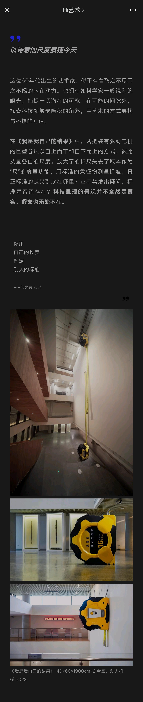

# BigTape
This is the archive for code used for the project `BigTape` installed in `PingShan Art Museum`.

## Highlights
- Running on three ESP32 modules with MicroPython, and communicate through HTTP on the local network.
    - See specs [`here`](https://item.taobao.com/item.htm?spm=a1z09.2.0.0.23412e8dIjpdVC&id=544098298735&_u=h5oppnr8c07)
- Async PID control based on position with [`MicroPython simple-pid`](https://micropython-simple-pid.readthedocs.io/en/latest/#)
- Absolute Rotatory Encoder through RS485 and ModBus RTU Serial with [`MicroPython Modbus library`](https://github.com/brainelectronics/micropython-modbus)
    - See specs of the absolute encoder [here](http://www.buruiter.com/col.jsp?id=116)
    - In the actual project, a LoRa Transmission Module is used for remote communication in RS485 and Modbus RTU Serial. See specs [here](https://item.taobao.com/item.htm?spm=a1z09.2.0.0.44c72e8dhUzPyZ&id=626911956873&_u=h5oppnrb721).
- DC Motors driven by H-Bridge with PWM.
    - See specs for the H-Bridge [here](https://item.taobao.com/item.htm?spm=a1z09.2.0.0.23412e8dIjpdVC&id=541299572681&_u=h5oppnr0e11)
- Dynamically setting PID position through HTTP server with [`MicroDot`](https://github.com/miguelgrinberg/microdot)
- Triggerable by human movement based on [`Xiaomi Human Body sensor`](https://detail.tmall.com/item.htm?spm=a230r.1.14.29.26cad854OZ6heK&id=678617599483&ns=1&abbucket=4)

## Notes for Reproduction
- Most of the third-party modules used in this project has been "frozen" into the firmware:
    - `PID`
    - `umodbus`
    - `copy`
    - `urequests`
    - `microdot_asyncio`
- Just for reference, `utility.py` contains some deprecated code from the unsuccessful usage of `incremental rotatory encoder` as the ESP32 used in this project fails to register every steps.
- The repo has been substantially purged for succinctness with only the working code left, which might lead to confusion should there be any mistakes. If necessary, open an issue.
